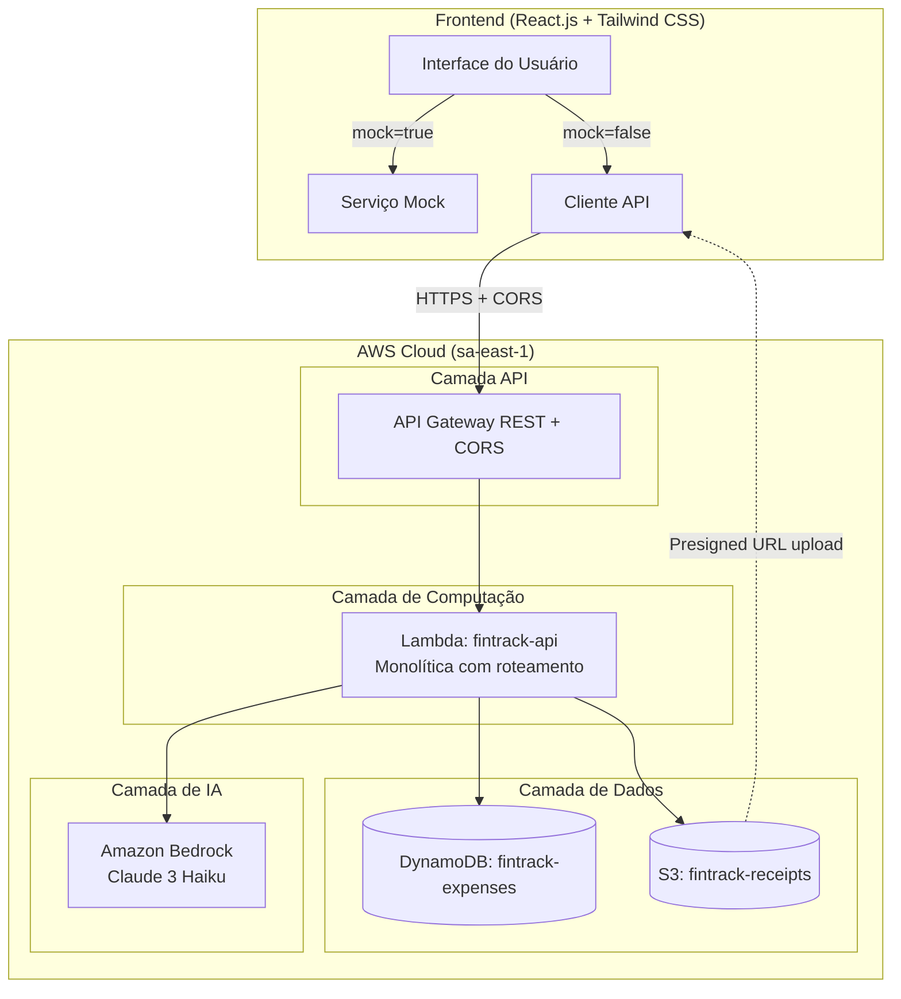
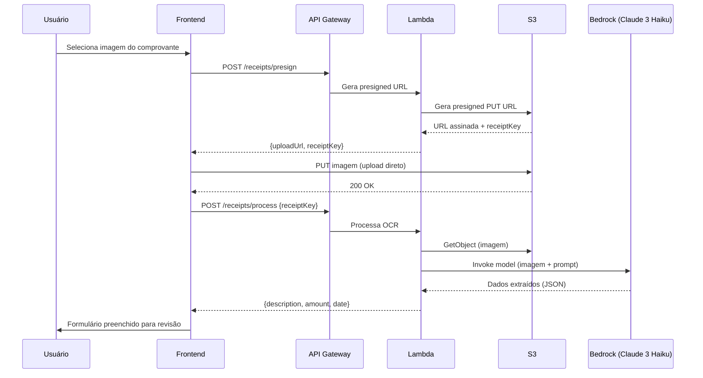

# FinTrack — Documento de Apresentação

## Sistema Inteligente de Gestão de Gastos Pessoais

Projeto acadêmico de desenvolvimento Full Stack — Aplicação web serverless com integração de Inteligência Artificial.

---

## 1. Visão Geral

O FinTrack é uma aplicação web para gerenciamento de despesas pessoais que utiliza IA para automatizar tarefas como classificação de gastos, extração de dados de comprovantes e geração de insights financeiros.

O sistema permite que o usuário registre despesas de duas formas:
1. **Manualmente** — preenchendo um formulário com descrição, valor, data e categoria
2. **Via upload de comprovante** — enviando uma foto de recibo/nota fiscal, onde a IA extrai automaticamente os dados

A aplicação conta com um dashboard interativo com gráficos e relatórios, além de insights gerados por IA sobre padrões e hábitos de consumo.

---

## 2. Funcionalidades Implementadas

| Funcionalidade | Descrição |
|---------------|-----------|
| CRUD de Despesas | Criar, listar, editar e excluir despesas com validação completa |
| Upload de Comprovantes | Upload de fotos de recibos (JPEG/PNG) via presigned URL |
| OCR com IA | Extração automática de valor, data e descrição usando Amazon Bedrock (Claude 3 Haiku multimodal) |
| Classificação Automática | IA sugere categoria da despesa (Alimentação, Transporte, Moradia, Saúde, Lazer, Educação, Outros) |
| Dashboard Interativo | Gráfico de pizza por categoria + gráfico de barras com evolução mensal |
| Insights com IA | Análise de padrões de gastos com sugestões de economia |
| Filtros | Filtrar despesas por categoria e período |
| Modo Mock | Frontend funciona independentemente do backend com dados simulados |

---

## 3. Stack Técnica

| Camada | Tecnologia |
|--------|-----------|
| Frontend | React.js 18 + Vite + Tailwind CSS + Recharts |
| Backend | Python 3.12 + AWS Lambda (monolítica com roteamento) |
| API | AWS API Gateway REST com CORS |
| Banco de Dados | Amazon DynamoDB (single-table design, PAY_PER_REQUEST) |
| Armazenamento | Amazon S3 (comprovantes) |
| IA / OCR | Amazon Bedrock — Claude 3 Haiku (multimodal) |
| Deploy | AWS SAM (Serverless Application Model) — infraestrutura como código |
| Região AWS | sa-east-1 (São Paulo) |

---

## 4. Arquitetura

### Diagrama de Arquitetura



### Fluxo de Upload de Comprovante (OCR)



---

## 5. Decisões de Design

| Decisão | Justificativa |
|---------|--------------|
| **Serverless (Lambda + API Gateway)** | Elimina gerenciamento de servidores, custo zero quando ocioso, ideal para MVP acadêmico |
| **Lambda monolítica** | Uma única função com roteamento interno simplifica deploy e manutenção |
| **DynamoDB single-table** | Design simples com PK/SK, adequado para MVP com usuário único |
| **Valores em centavos (inteiro)** | Evita problemas de arredondamento com ponto flutuante em valores monetários |
| **Bedrock Claude multimodal para OCR** | Amazon Textract não está disponível em sa-east-1; Claude 3 Haiku aceita imagens e extrai dados de recibos |
| **Presigned URL para upload** | Upload direto ao S3 evita o limite de 6MB do payload do Lambda |
| **Modo mock no frontend** | Permite desenvolvimento frontend independente sem acesso à AWS |
| **AWS SAM para deploy** | Infraestrutura como código — um comando cria tudo, outro destrói tudo |
| **CORS habilitado** | Necessário para comunicação browser → API Gateway |

---

## 6. Modelo de Dados (DynamoDB)

### Tabela: `fintrack-expenses`

| Atributo | Tipo | Descrição |
|----------|------|-----------|
| PK | String | `USER#<userId>` |
| SK | String | `EXPENSE#<date>#<uuid>` |
| expenseId | String | UUID v4 único |
| description | String | Descrição da despesa |
| amount | Number | Valor em centavos (R$ 42,50 → 4250) |
| date | String | Data ISO 8601 (YYYY-MM-DD) |
| category | String | Alimentação, Transporte, Moradia, Saúde, Lazer, Educação, Outros |
| paymentMethod | String | Dinheiro, Cartão de Crédito, Cartão de Débito, PIX, Outros |
| receiptKey | String | Chave S3 do comprovante (opcional) |

### GSI: `CategoryIndex`
- PK: `userId` → SK: `category`
- Permite consultas eficientes por categoria

---

## 7. API REST — Endpoints

| Método | Endpoint | Descrição |
|--------|----------|-----------|
| POST | `/expenses` | Criar despesa |
| GET | `/expenses` | Listar despesas (filtros: category, startDate, endDate) |
| GET | `/expenses/{id}` | Obter despesa por ID |
| PUT | `/expenses/{id}` | Atualizar despesa |
| DELETE | `/expenses/{id}` | Excluir despesa |
| POST | `/receipts/presign` | Gerar URL para upload de comprovante |
| POST | `/receipts/process` | Processar OCR do comprovante via IA |
| POST | `/classify` | Classificar descrição em categoria via IA |
| POST | `/insights` | Gerar insights de gastos via IA |

---

## 8. Testes Automatizados

O projeto utiliza testes baseados em propriedades (Property-Based Testing) para validar correção formal do sistema.

### Backend (Python — Hypothesis)
- 14 propriedades de correção definidas
- Testes com 100+ iterações cada usando geradores aleatórios
- Cobertura: validação, CRUD, classificação, insights

### Frontend (Vitest — fast-check)
- Formatação brasileira (R$, DD/MM/AAAA)
- Cálculo de totais
- Independência do modo mock

---

## 9. Gerenciamento de Recursos AWS

Todos os recursos são gerenciados como uma única CloudFormation stack:

```bash
# Provisionar tudo
cd backend && sam build && sam deploy --region sa-east-1

# Destruir tudo
aws s3 rm s3://fintrack-receipts-{account-id} --recursive --region sa-east-1
sam delete --stack-name fintrack-stack --region sa-east-1

# Re-provisionar do zero
cd backend && sam build && sam deploy --region sa-east-1
```

Recursos criados (todos com prefixo `fintrack-`):
- Lambda, API Gateway, DynamoDB, S3, IAM Role, CloudWatch Logs

---

## 10. Repositório

- GitHub: [https://github.com/franciscoaero/fintrack](https://github.com/franciscoaero/fintrack)
