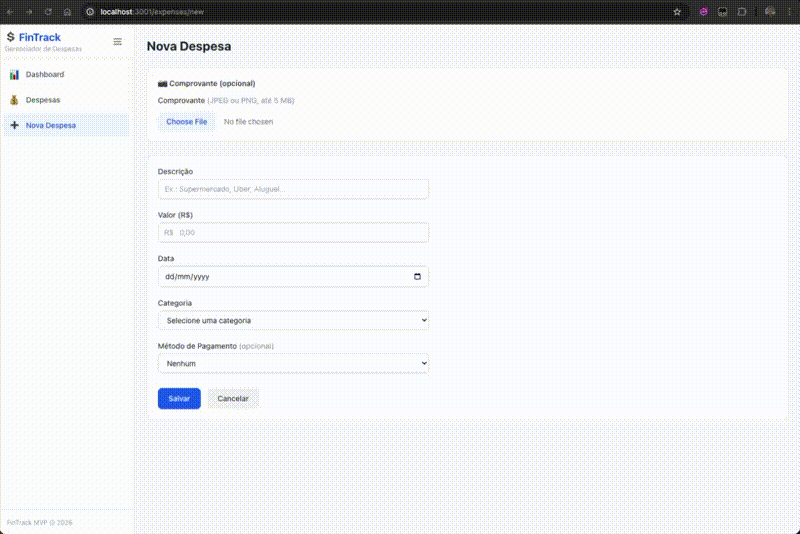

# FinTrack — Gerenciador de Despesas Pessoais com IA

Aplicação web serverless para gerenciamento de despesas pessoais com integração de Inteligência Artificial. Desenvolvido como projeto acadêmico de desenvolvimento Full Stack.



## Funcionalidades

- Registro de despesas manual ou via upload de comprovantes (OCR)
- Classificação automática de categorias por IA (Amazon Bedrock)
- Dashboard interativo com gráficos de gastos
- Insights gerados por IA sobre hábitos de consumo
- Filtros por categoria e período

## Stack Técnica

| Camada | Tecnologia |
|--------|-----------|
| Frontend | React.js + Vite + Tailwind CSS + Recharts |
| Backend | Python + AWS Lambda + API Gateway |
| Banco de Dados | Amazon DynamoDB |
| Armazenamento | Amazon S3 |
| IA / OCR | Amazon Bedrock (Claude 3 Haiku — multimodal) |
| Deploy | AWS SAM (Serverless Application Model) |

## Estrutura do Projeto

```
fintrack/
├── frontend/              # Aplicação React.js (Vite)
│   ├── src/
│   │   ├── components/    # Componentes React (Dashboard, ExpenseForm, etc.)
│   │   ├── services/      # Comunicação com API + mock service
│   │   └── utils/         # Utilitários (formatação R$, validação)
│   └── .env.example
├── backend/               # Lambda monolítica (Python)
│   ├── src/
│   │   ├── handlers/      # Handlers por domínio (expenses, receipts, classify, insights)
│   │   ├── services/      # Lógica de negócio (CRUD, OCR, classificação, insights)
│   │   └── utils/         # Utilitários (validação, resposta HTTP, DynamoDB client)
│   ├── tests/             # Testes de propriedade (Hypothesis)
│   ├── template.yaml      # AWS SAM template (infraestrutura como código)
│   └── .env.example
├── .gitignore
└── README.md
```

## Pré-requisitos

- [Node.js](https://nodejs.org/) (v18+)
- [Python](https://www.python.org/) (3.9+)
- [AWS CLI](https://aws.amazon.com/cli/) configurado com credenciais válidas
- [AWS SAM CLI](https://docs.aws.amazon.com/serverless-application-model/latest/developerguide/install-sam-cli.html)
- Conta AWS com acesso a: DynamoDB, S3, Lambda, API Gateway, Bedrock (Claude 3 Haiku em sa-east-1)

---

## Como Testar (Passo a Passo)

### Opção 1: Modo Mock (sem AWS — ideal para desenvolvimento frontend)

Não precisa de conta AWS. O frontend funciona com dados fictícios em memória.

```bash
# 1. Instalar dependências do frontend
cd frontend
npm install

# 2. Criar arquivo .env (modo mock já é o padrão)
cp .env.example .env

# 3. Iniciar o servidor de desenvolvimento
npm run dev
```

Abra `http://localhost:3001` no navegador. Todas as funcionalidades funcionam com dados simulados.

### Opção 2: Com Backend Real na AWS

```bash
# 1. Deploy do backend (cria todos os recursos AWS)
cd backend
cp samconfig.toml.example samconfig.toml
sam build
sam deploy --guided --region sa-east-1
```

Ao final do deploy, o SAM exibe a URL do API Gateway nos outputs:
```
Key                 ApiGatewayUrl
Value               https://XXXXXXXXXX.execute-api.sa-east-1.amazonaws.com/Prod
```

```bash
# 2. Configurar o frontend para usar o backend real
cd ../frontend
npm install
cp .env.example .env
```

Edite o arquivo `frontend/.env`:
```
VITE_API_URL=https://XXXXXXXXXX.execute-api.sa-east-1.amazonaws.com/Prod
VITE_USE_MOCK=false
```

```bash
# 3. Iniciar o frontend
npm run dev
```

Abra `http://localhost:3001` no navegador. Agora o frontend está conectado ao backend real na AWS.

### O que testar

1. **Dashboard** (`/`) — gráficos de pizza e barras, total em R$, filtro por período
2. **Nova Despesa** (`/expenses/new`) — preencher formulário, a IA sugere a categoria automaticamente
3. **Upload de Comprovante** — enviar foto de recibo, o Bedrock extrai valor/data/descrição
4. **Lista de Despesas** (`/expenses`) — filtrar por categoria e período, editar e excluir
5. **Insights com IA** — no Dashboard, clicar "Gerar Insights" (precisa de pelo menos 3 despesas)

---

## Modo Mock (Desenvolvimento sem AWS)

O frontend suporta um modo de dados simulados para desenvolvimento independente:

- Defina `VITE_USE_MOCK=true` no arquivo `.env` do frontend
- Todas as operações CRUD funcionam com dados fictícios em memória
- Classificação, OCR e insights retornam dados simulados
- Nenhuma chamada HTTP é feita ao backend

---

## Testes Automatizados

### Backend (Python — Hypothesis)
```bash
cd backend
pip install -r requirements.txt
python -m pytest tests/ -v
```

### Frontend (Vitest — fast-check)
```bash
cd frontend
npm run test
```

---

## Deploy e Gerenciamento de Recursos AWS

### Provisionar todos os recursos
```bash
cd backend
sam build
sam deploy --region sa-east-1
```

Recursos criados (todos com prefixo `fintrack-`):
- Lambda: `fintrack-api`
- API Gateway: `fintrack-api`
- DynamoDB: `fintrack-expenses`
- S3: `fintrack-receipts-{account-id}`
- IAM Role: `fintrack-api-role`
- CloudWatch Logs: `/aws/lambda/fintrack-api`

### Destruir todos os recursos
```bash
# Esvaziar o bucket S3 primeiro
aws s3 rm s3://fintrack-receipts-{account-id} --recursive --region sa-east-1

# Remover a stack (deleta todos os recursos)
sam delete --stack-name fintrack-stack --region sa-east-1
```

### Re-provisionar do zero
```bash
cd backend
sam build
sam deploy --region sa-east-1
```

---

## API Endpoints

| Método | Endpoint | Descrição |
|--------|----------|-----------|
| `POST` | `/expenses` | Criar despesa |
| `GET` | `/expenses` | Listar despesas (query: category, startDate, endDate) |
| `GET` | `/expenses/{id}` | Obter despesa por ID |
| `PUT` | `/expenses/{id}` | Atualizar despesa |
| `DELETE` | `/expenses/{id}` | Excluir despesa |
| `POST` | `/receipts/presign` | Gerar URL para upload de comprovante |
| `POST` | `/receipts/process` | Processar OCR do comprovante |
| `POST` | `/classify` | Classificar descrição em categoria (IA) |
| `POST` | `/insights` | Gerar insights de gastos (IA) |

---

## Repositório

- GitHub: [https://github.com/franciscoaero/fintrack](https://github.com/franciscoaero/fintrack)

## Licença

Projeto acadêmico — uso educacional.
